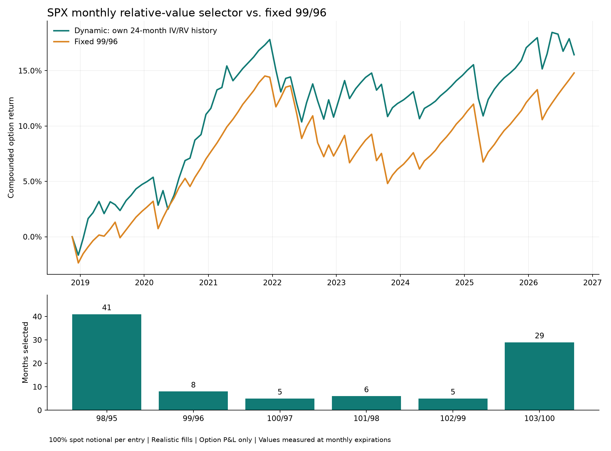

# Relative value of monthly SPX put spreads

The 24-month historical normalization produces a changing allocation across all six spreads. It returns **1.96% CAGR and 0.510 Sharpe**, compared with **1.78% and 0.508** for fixed 99/96 on identical dates. The CAGR difference is +0.18 percentage points per year; the Sharpe difference is +0.002.

For candidate spread s at monthly entry t:

```
current_ratio(s,t) = short_put_IV(s,t) / trailing_21_session_SPX_RV(t)
usual_ratio(s,t) = median of current_ratio(s,u) over its previous 24 available monthly entries u < t
richness_score(s,t) = current_ratio(s,t) / usual_ratio(s,t) - 1
```

Sell the spread with the highest signed score among 98/95, 99/96, 100/97, 101/98, 102/99 and 103/100. A score of +25% means its IV/RV ratio is 25% above its own trailing median. Each spread has its own changing historical denominator; the current observation is excluded from that denominator. Exact ties favor the lower short strike. Trade every eligible month, including months in which every candidate scores below zero. The 24-month window is the primary specification; 12 and 36 months are sensitivity checks rather than a search for the best window.

There is a useful algebraic limit: current RV is still common to all spreads. At a particular entry, it cancels from the ranking, which becomes `short_IV(s,t) / usual_ratio(s,t)`. The historical denominator makes this a dynamic measure of relative richness on the volatility surface; current realized volatility alone does not drive the choice. This corrects the fixed preference for high-IV downside strikes, but does not establish that a whole vertical is mispriced. A vertical has two legs and no unique quoted IV. The primary score uses the short leg; a mean-of-both-legs sensitivity is provided below. This is an unhedged put-spread strategy whose returns also reflect equity exposure.

The source option archive covers September 22, 2016 through September 22, 2026. The first 24 available monthly entries establish history. There is no PM contract for the November-December 2016 cycle. The executable comparison therefore covers **November 16, 2018 through September 18, 2026, 94 consecutive monthly trades**. The 10-year archive supplies the history and subsequent evaluation; a 10-year trading result cannot be claimed for this rule without earlier training data. Both strategies begin and end on the same dates.

| Portfolio | CAGR | Annualized monthly Sharpe | Annualized monthly volatility | Max drawdown at rolls | Winning months |
|---|---:|---:|---:|---:|---:|
| Dynamic: own 24-month IV/RV history | 1.96% | 0.510 | 3.96% | -6.32% | 74.5% |
| Fixed 99/96 | 1.78% | 0.508 | 3.60% | -8.48% | 79.8% |

Selections: 98/95: 41; 99/96: 8; 100/97: 5; 101/98: 6; 102/99: 5; 103/100: 29. The spread changes 46 times between consecutive entries. In 39 months the selected score is below zero. Full scores, historical window boundaries, strikes, leg quotes, IVs, position sizing, and cash-settlement returns are saved in the CSV/parquet artifacts.

The mean-of-both-leg-IV version with 24 prior entries produces 2.03% CAGR and 0.502 Sharpe on the same primary dates. This tests a different spread-IV convention; neither convention is a unique implied volatility for the net spread.

The lookback checks below all use the same 82 months, from November 15, 2019 to September 18, 2026, after the longest warmup. Comparing windows on the same dates avoids mixing window effects with sample effects.

| History observations | Portfolio | CAGR | Sharpe |
|---|---|---:|---:|
| 12 | Dynamic: 12-month history | 0.57% | 0.157 |
| 12 | Fixed 99/96 | 1.78% | 0.503 |
| 24 | Dynamic: 24-month history | 1.62% | 0.420 |
| 24 | Fixed 99/96 | 1.78% | 0.503 |
| 36 | Dynamic: 36-month history | 1.97% | 0.476 |
| 36 | Fixed 99/96 | 1.78% | 0.503 |

None of these windows beats the fixed benchmark on Sharpe over the common period. The primary CAGR advantage is small and depends on the reference window and sample dates; these results do not establish a reliable performance improvement.

For context, these fixed candidates use the same primary evaluation dates:

| Fixed strategy | CAGR | Sharpe |
|---|---:|---:|
| Fixed 98/95 | 1.43% | 0.448 |
| Fixed 99/96 | 1.78% | 0.508 |
| Fixed 100/97 | 2.19% | 0.570 |
| Fixed 101/98 | 2.35% | 0.581 |
| Fixed 102/99 | 2.37% | 0.547 |
| Fixed 103/100 | 2.52% | 0.554 |

Execution and accounting follow the preceding research: third-Friday monthly PM-settled SPXW spreads, next monthly expiration, nearest listed strikes to the cash-SPX percentages, held to expiry. Three-wide denotes three percentage points of SPX spot. Notional equals 100% of current equity at each entry, with fractional contracts `equity / (100 * entry SPX)`. Realistic entry fills are one-quarter of the full bid/ask spread away from midpoint plus $1.50 per contract per leg; no exit spread is charged on cash settlement. Midpoint and natural bid/ask sensitivities are also in summary.csv. Option-only P&L excludes interest on collateral, taxes, and settlement fees.

Realized volatility is the sample standard deviation of 21 simple cash-SPX close-to-close returns through the entry close, annualized by sqrt(252). The cash close and the EOD option snapshot share the same-date convention from the preceding study; it assumes execution at that snapshot and is not a tested next-session fill. The archive's expiration-specific underlying_price field is never used for cash spot or settlement. CAGR compounds net monthly returns over exact elapsed calendar years. Sharpe is mean monthly option return divided by sample standard deviation times sqrt(12), with zero cash rate. Drawdown is measured at monthly rolls, not daily marked-to-market. The candidate prices reconcile to the earlier research; the selection uses only entry data and prior history, never the subsequent payoff.



Reproduce from the existing candidate archive: `python scripts/run_relative_value_spread_selector.py`. Rebuild the candidate archive with `python scripts/run_dynamic_iv_spread_selector.py` if needed. Run checks using `python -m unittest discover -s tests -v` from the project directory.
