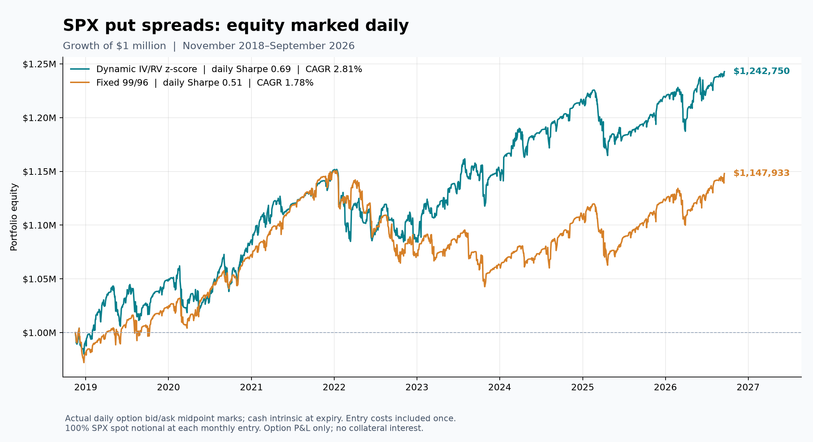

# Daily valuation of dynamic SPX spreads versus fixed 99/96

Both strategies use the exact 94 original trades from November 16, 2018 through September 18, 2026. Open short and long legs are valued using their actual EOD bid/ask midpoints on each trading session. Expiration uses intrinsic value at the cached SPX cash close. This produces 1,968 daily return observations per portfolio, including first-entry slippage and commissions. There are no interpolated option prices, filled-forward missing marks, or artificial zero-P&L holding days.

| Portfolio | Daily Sharpe | Previous monthly Sharpe | CAGR | Annualized daily volatility | Daily max drawdown | Ending equity |
|---|---:|---:|---:|---:|---:|---:|
| Dynamic: 24-month IV/RV z-score | 0.691 | 0.688 | 2.81% | 4.16% | -5.88% | $1,242,750 |
| Fixed 99/96 | 0.509 | 0.508 | 1.78% | 3.60% | -9.38% | $1,147,933 |

Daily Sharpe is `mean(daily return) / sample_std(daily return) * sqrt(252)` with zero cash rate. Each daily return is the change in equity divided by the prior session's equity; the first entry uses initial capital of $1 million. CAGR uses exact elapsed calendar years and final equity. Collateral interest, taxes, and settlement fees remain excluded.

At each monthly roll the old trade settles first. Its cash equity reconciles to the original monthly backtest; the new trade is then sized at 100% of that equity divided by cash SPX times 100. The new trade's closing NAV immediately reflects entry slippage and commissions. Daily equity on a roll can therefore differ slightly from the previous chart's pre-new-entry settlement equity. All 188 trade settlements reconcile, and both terminal equity values are unchanged.

Entry execution remains one-quarter of each leg's full bid/ask spread away from midpoint plus $1.50 per contract per leg. These costs are charged once at entry; daily mid marks do not incur hypothetical liquidation costs. The saved trade strikes, symbols, entries, expirations, and quantities are preserved. Daily quotes validate date, symbol, strike, expiration, finite nonnegative bid, and ask at least bid. All 7,271 required daily leg quotes are present. 13 portfolio-date midpoint spread values lie outside the undiscounted payoff range by more than 0.01 point; any such observations are separately saved in spread_bound_flags.csv for inspection.

As a sensitivity check, bounding daily midpoint spread values to [0, strike width] produces annualized daily Sharpes of Dynamic: 24-month IV/RV z-score: 0.690645; Fixed 99/96: 0.508736. This does not replace the primary observed-midpoint marks. The small quote-midpoint discrepancies have negligible influence on the results.

Reproduce: `python scripts/mark_standardized_spread_daily.py`. Audit data include actual daily leg quotes, daily equity and returns, entry costs, and the reconciliation of every expiration to the original monthly backtest.
