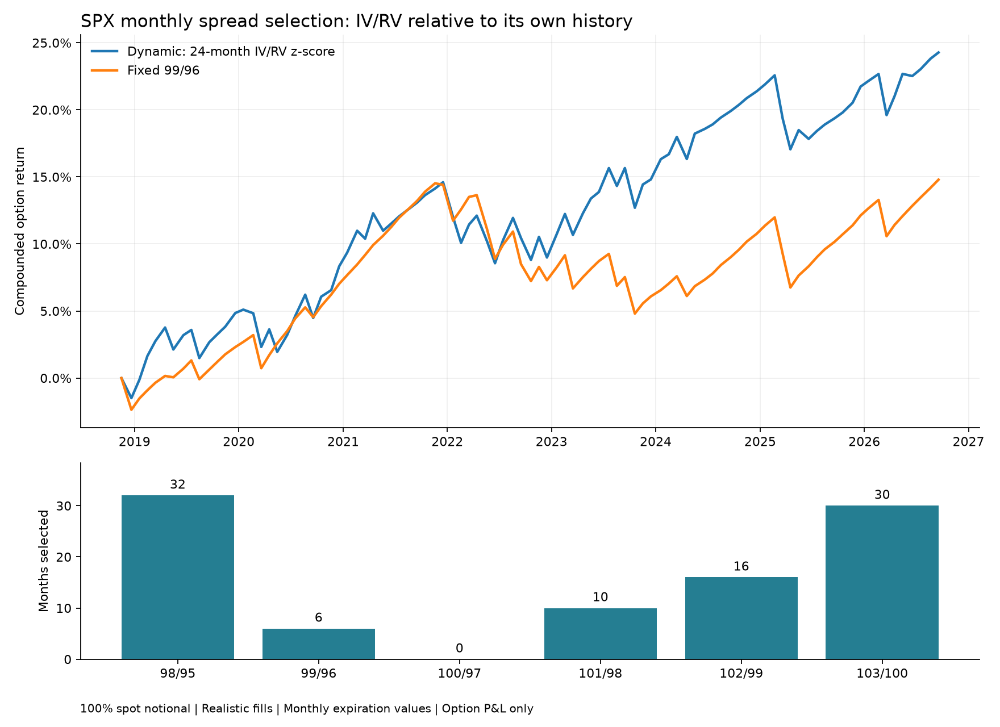

# Monthly SPX spread selection by historical IV/RV z-score

This rule measures how unusually high each candidate's current IV/RV ratio is relative to its own history. It has a changing numerator (distance from its own usual ratio) and a changing, spread-specific denominator (the usual variability of that ratio). Current realized volatility can affect the ranking, because each spread has a different historical mean and standard deviation.

For each of 98/95, 99/96, 100/97, 101/98, 102/99 and 103/100:

```
X(s,t) = short_put_IV(s,t) / trailing_21_session_SPX_RV(t)
mu(s,t) = mean of X for this spread's previous 24 available monthly entries
sd(s,t) = sample standard deviation of those same 24 previous X observations
score(s,t) = (X(s,t) - mu(s,t)) / sd(s,t)
```

Sell the spread with the highest signed score. A score of +2 means its IV/RV ratio is two historical standard deviations above its own previous average. All baseline observations strictly precede the current entry. Twenty-four observations is the primary window, with 12 and 36 as prespecified sensitivity checks. This window was retained before running the z-score results. No window or score is selected based on subsequent trading performance. Exact ties favor the lower short strike. A zero historical standard deviation invalidates the score; it does not arise in the actual sample. Every eligible month has all six candidates, and the strategy always trades even if all scores are negative.

The rule earns **2.81% CAGR with 0.688 Sharpe**, compared with **1.78% and 0.508** for fixed 99/96. It changes spreads 49 times across **94 monthly trades, November 16, 2018 through September 18, 2026**. The archive covers September 2016-September 2026; the first 24 available monthly entries supply the historical reference, so this is about eight years of trading evaluation using ten years of data. The unavailable November-December 2016 PM contract lies in the history-building period. Every evaluation month is present.

| Strategy | CAGR | Annualized monthly Sharpe | Annualized monthly volatility | Max drawdown at rolls |
|---|---:|---:|---:|---:|
| Dynamic: 24-month IV/RV z-score | 2.81% | 0.688 | 4.16% | -5.27% |
| Fixed 99/96 | 1.78% | 0.508 | 3.60% | -8.48% |

Selections: 98/95: 32; 99/96: 6; 100/97: 0; 101/98: 10; 102/99: 16; 103/100: 30. The selected score is negative in 47 months. These are the richest available candidates under the rule, not evidence of absolute overpricing. A vertical has no unique quoted IV; this specification ranks the short-leg IV and realizes P&L on both legs. It measures relative volatility richness rather than estimating a full spread's economic fair value. A two-leg fair-value residual using contemporaneous forward, discount rate, and a realized-volatility payoff model would test a different hypothesis.

The 12-, 24-, and 36-observation checks use identical dates after the longest history requirement: November 15, 2019 through September 18, 2026, 82 months.

| History observations | Strategy | CAGR | Sharpe |
|---|---|---:|---:|
| 12 | Dynamic: 12-month IV/RV z-score | 1.85% | 0.447 |
| 12 | Fixed 99/96 | 1.78% | 0.503 |
| 24 | Dynamic: 24-month IV/RV z-score | 2.66% | 0.655 |
| 24 | Fixed 99/96 | 1.78% | 0.503 |
| 36 | Dynamic: 36-month IV/RV z-score | 2.31% | 0.560 |
| 36 | Fixed 99/96 | 1.78% | 0.503 |

The 24- and 36-observation versions beat the benchmark on CAGR and Sharpe over the common period. The 12-observation version loses on Sharpe, so the improvement is sensitive to the reference window. Much of the primary strategy's advantage comes from its 2023 trades. These are exploratory results, with the score family refined during this research; they are not an independent holdout validation or proof of a persistent edge.

Using the mean of the two leg IVs in X, with the same 24-prior-observation z-score, gives 2.71% CAGR and 0.687 Sharpe over the primary period. The simpler own-median ratio normalization previously examined gives 1.96% CAGR and 0.510 Sharpe. Unlike the z-score, that simpler ratio makes current RV cancel from the monthly ranking. These alternatives are diagnostics; none is evidence that a chosen spread is necessarily overpriced.

All comparisons use 100% of current equity as SPX cash-spot notional each month, with contracts = equity / (cash SPX * 100), fractional contracts, and compounding. Three-wide means three percentage points of cash SPX, rounded to nearest listed strikes. Positions are PM-settled SPXW put spreads entered at the third-Friday monthly EOD snapshot and held to the next monthly expiration, with cash intrinsic settlement. Realistic fills are 25% of the full bid/ask spread away from midpoint plus $1.50 per contract per leg. Midpoint and natural bid/ask sensitivity results are also saved. Cash spot and settlement come from cached Yahoo ^GSPC closes, not the archive's expiration-specific underlying_price field.

RV is the sample standard deviation of the latest 21 simple close-to-close SPX returns through the entry close times sqrt(252). The entry-close and EOD quote convention assumes execution at the same snapshot. Future prices and future option payoffs never enter the selection or historical reference. CAGR compounds normalized monthly P&L over exact elapsed calendar years. Sharpe uses mean monthly option return / sample standard deviation * sqrt(12), with zero cash rate. No collateral interest, taxes, or settlement fees are included. Drawdown is observed at monthly rolls and does not measure intramonth marked-to-market losses.



Reproduce: `python scripts/run_standardized_iv_rv_spread_selector.py` from the project directory. Source candidates are built by `python scripts/run_dynamic_iv_spread_selector.py`. Tests: `python -m unittest discover -s tests -v`. Entry-level score histories and all six candidate outcomes are saved for audit.
